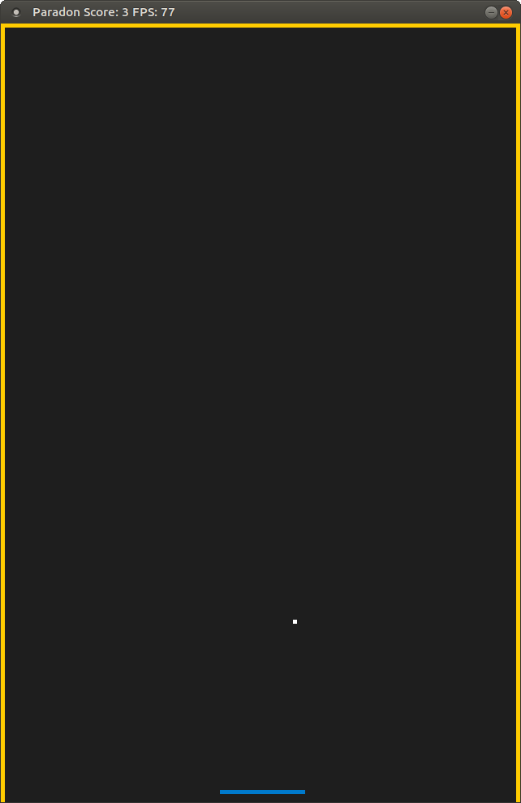

# CPPND: Capstone Paredon Game

This is a game pong-inspired called **Paredon**, this was coded for the Capstone project in the [Udacity C++ Nanodegree Program](https://www.udacity.com/course/c-plus-plus-nanodegree--nd213). The code for this repo was inspired by [this](https://codereview.stackexchange.com/questions/212296/snake-game-in-c-with-sdl) excellent StackOverflow post and set of responses, then modified to get a new game.

The object of the game is to try to keep the ball within the playing area for as long as possible. Three walls help from the top, left and right sides. Underneath a movable platform is used to bounce the ball into the playing area. This platform is moved using the left and right keys of the keyboard. The game ends when the ball leaves the area.

## Dependencies for Running Locally
* cmake >= 3.7
  * All OSes: [click here for installation instructions](https://cmake.org/install/)
* make >= 4.1 (Linux, Mac), 3.81 (Windows)
  * Linux: make is installed by default on most Linux distros
  * Mac: [install Xcode command line tools to get make](https://developer.apple.com/xcode/features/)
  * Windows: [Click here for installation instructions](http://gnuwin32.sourceforge.net/packages/make.htm)
* SDL2 >= 2.0
  * All installation instructions can be found [here](https://wiki.libsdl.org/Installation)
  * Note that for Linux, an `apt` or `apt-get` installation is preferred to building from source.
* gcc/g++ >= 5.4
  * Linux: gcc / g++ is installed by default on most Linux distros
  * Mac: same deal as make - [install Xcode command line tools](https://developer.apple.com/xcode/features/)
  * Windows: recommend using [MinGW](http://www.mingw.org/)

## Basic Build Instructions

1. Clone this repo.
2. Make a build directory in the top level directory: `mkdir build && cd build`
3. Compile: `cmake .. && make`
4. Run it: `./paredon`.

## Rubric Completion

This capstone project is based in this [rubric](https://review.udacity.com/#!/rubrics/2533/view) completion. These are the details.

### Readme

You are seing it right now. It has detailed instructions for building/running, decribe the project and the rubric points addressed.

### Compiling and Testing

Source code was compiled and tested in a local machine using g++ 7.5.0 in Ubuntu 18.04 and in the Udacity Workspace

### Loops, Functions, I/O

* A variety of control structures was used in this project (for, while, if, switch).

### Object Oriented Programming

* The project code is organized into classes with class attributes to hold the data, and class methods to perform tasks. 
* All class data members are explicitly specified as public, protected, or private.
* All class members that are set to argument values are initialized through member initialization lists.
* All class member functions document their effects, either through function names, comments, or formal documentation. Member functions do not change program state in undocumented ways.
* Appropriate data and functions are grouped into classes. Member data that is subject to an invariant is hidden from the user. State is accessed via member functions.
* One member function in an inherited class overrides a virtual base class member function.

### Memory Management

* At least two variables are defined as references, or two functions use pass-by-reference in the project code.
* The project uses at least one smart pointer: unique_ptr, shared_ptr, or weak_ptr. The project does not use raw pointers.

### Concurrency

* The project uses multiple threads in the execution.
* A mutex or lock (e.g. std::lock_guard or `std::unique_lock) is used to protect data that is shared across multiple threads in the project code.
